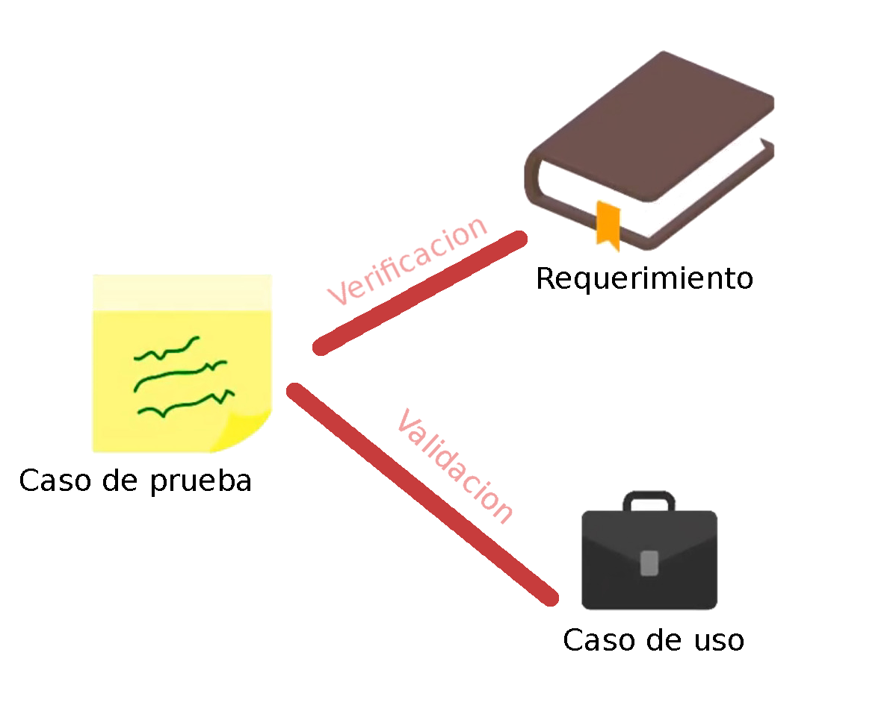

# Práctica 5 | CEPS: Capitulo 2 | 17284052

## Capitulo 2: Fundamentos del ejecutador de pruebas
----
  - [Conceptos Basicos de Pruebas](#conceptos-basicos-de-pruebas)
    - [Prueba de Software](#prueba-de-software)
    - [Tipos de Prueba de Software](#tipos-de-pruebas-de-software)
    - [Ciclo de Vida de un Proyecto de Prueba](#ciclo-de-vida-de-un-proyecto-de-prueba)
    - [Test Cases](#test-cases)
    - [Script de Pruebas](#script-de-pruebas)
    - [Datos de Prueba](#datos-de-prueba)
    - [TestWare](#testware)
  - [Ejecucion de Pruebas](#ejecucion-de-pruebas)
  - [Tipos de Proyectos de Prueba](#tipos-de-proyectos-de-prueba)
  - [Areas de Prueba](#areas-de-prueba)
    
----
### Conceptos Basicos de Pruebas

#### Prueba de Software 
Una prueba de software es la *validacion* y *verificacion* de los requerimientos del aplicativo

<p align="center"></p>

> **Validacion:** La validacion confirma que el producto final cumple con su proposito. Es hacer el producto "correcto"
>
> **Verificacion:** La verificiacion confirma que el prpoducto cumpla con los requerimientos. Es hacer el producto "correctamente"

Las pruebas de software se realizan a las partes funcionales y no funcionales con la intencion de encontrar errores y resolverlos, se hacen para medir y mejorar la calidad del producto

#### Tipos de Pruebas de Software

Funcionales | No Funcionales
------------ | -------------
**Manual:** Aquellas que se realizan manualmente, <br /> interactuando directamente con los elementos del sistema | **Desempen~io:** Buscan leer el uso de recursos de una aplicacion en diferentes escenarios 
**Automaticas:** Herramientas/programas para automatizar las pruebas manuales |**Seguridad:** Validar que no existen posibles vulnerabildades o exploits

#### Ciclo de vida de un proyecto de prueba

<p align="center"></p>

### Test Cases
<p align="center"></p>


Entradas o Precondiciones diferentes, daran salidas y poscondiciones diferentes.

Un TestCase se puede entender como la combinacion de elementos que permiten poder probar que el sistema hace lo que debe de hacer y no hace lo que no debe de hacer

#### Script de pruebas

Un script de pruebas es el paso a pasos para poder reproducir un test case
Un buen script de pruebas debe de ser entendible sin ayuda de la persona que creo el script, no tener hardcode, y ser reutilizable.

*Pasos basicos de un script de prueba:*:
1. Como acceder a la aplicacion a probar
2. Como colocar las precondiciones
3. Como ejecutar cada paso
4. Como validar el resultado esperado
5. Como validar las poscondiciones
6. Como salir de la aplicacion a probar

#### Datos de Prueba

Usualmente cada TestCase requiere de entradas. Los datos de prueba son **todos los datos requeridos** para ejecutar una prueba o set de pruebas

*Tipos de datos de prueba*
  - Estaticos: No cambian durante el transcurso de la ejecucion de las pruebas. Reutilizables
  - Dinamicos: Cambian durante el transcurso de la ejecucion de las pruebas. "Se queman"

#### TestWare

El TestWare es un conjunto de pruebas o material de pruebas relacionados que tienen caracteristicas similares

### Ejecucion de Pruebas

La ejecucion de pruebas consiste en tomar y ejecutar cada uno de los casos de prueba previamente disen~ados, esto se puede realizar mediante herramientas, matrices de prueba, o una combinacion de las dos

**Ejemplo sencillo de ejecucion de pruebas usando una matriz de prueba**
```python
import unittest
from holi import foo

class TestAB(unittest.TestCase):
    def test_suma(self):
        test_cases = (
            {
                "entrada_a": 5, 
                "entrada_b": 24, 
                "salida_esperada": 29,
                "error": False,
            },
            {
                "entrada_a": -2, 
                "entrada_b": 24, 
                "salida_esperada": 22,
                "error": False,
            },
            {
                "entrada_a": -6, 
                "entrada_b": -2, 
                "salida_esperada": -8,
                "error": False,
            },
            {
                "entrada_a": "cosas", 
                "entrada_b": "malas", 
                "salida_esperada": "",
                "error": True,
            },
        )

        for tc in test_cases:
            if tc["error"]:
                with self.assertRaises(Exception):
                    foo(tc["entrada_a"], tc["entrada_b"])
            else:
                salida_real = foo(tc["entrada_a"], tc["entrada_b"])
                self.assertEqual(salida_real, tc["salida_esperada"])

if __name__ == '__main__':
    unittest.main()
```
El resultado esperado se compara con el resultado obtenido. Si es igual, el testcase pasa, si no es igual, el testcase no pasa.
Durante este proceso, se va generando documentacion sobre cada caso de prueba y sus resultados

La ejecucion de pruebas, se "detona", o realiza durante las fases de disen~o de pruebas, ejecucion de pruebas, y UAT.
Los casos de prueba se pueden agrupar en sets de casos de prueba, con la intencion de integrarlos en *ciclos de prueba* que cumplan con un objetivo especifico

### Tipos de Proyectos de Prueba

En general, se pueden dividir los proyectos de prueba en tres tipos.

  - **Nuevos:** Se hacen pruebas a desarrollos grandes o nuevas tecnologias implementadas
  - **Mantenimiento:** Modificaciones y actualizaciones a desarrollos ya existentes
  - **Incidentes/Hotfixes:** Pruebas para resolver problemas en produccion. Usualmente pequen~ios pero altamente criticos en tiempo
  
### Areas de prueba

En general, se puede dividir a un proyecto de prueba en cuatro areas:

  - **Area de Pruebas Funcionales:** Esta area se encarga de validar los requerimientos funcionales del software. Valida que el software cumpla con lo que debe de hacer
  - **Area de Pruebas No Funcionales:** Esta area se encarga de validar los requerimientos no funcionales del software. Valida los atributos del sistema, y los requerimientos de calidad (Performance, Reliability, Seguridad, etc.)
  - **Area de Pruebas de Ambiente:** Esta area se encarga de mantener el ambiente de pruebas disponible y utilizable para los proyectos. Se encarga de proveer los datos de prueba
  - **Control de pruebas:** Se encarga de monitorear el desempen~io de las demas areas en un proyecto de pruebas. Mide y ofrece indicadores para la toma de decisiones. es el "juez de las demas areas de pruebas"
  
