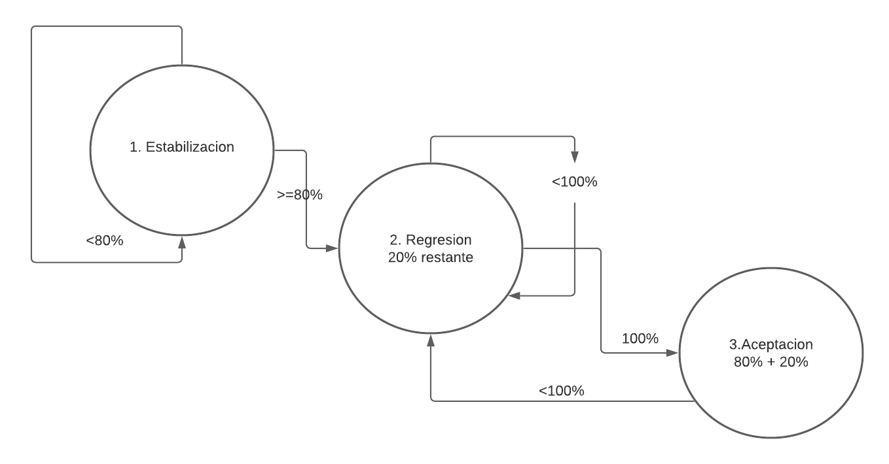
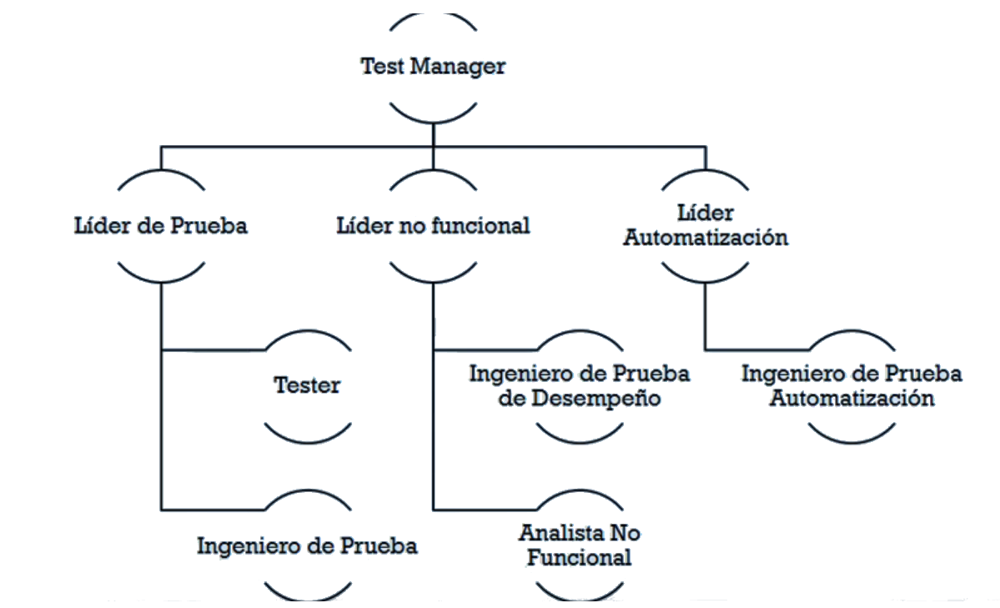

# Práctica 6 | CEPS: Capitulo 3 | 17284052

## Capitulo 3: Proceso de Ejecucion de Pruebas
----
  - [Modelo de Ejecucion de Pruebas ERA](#modelo-de-ejecucion-de-pruebas-era)
  - [Prerequisitos para Iniciar](#prerequisitos-para-iniciar)
    - [Casos de Prueba](#casos-de-prueba)
    - [Datos de Prueba](#datos-de-prueba)
    - [Ventana de Prueba Funcional](#ventana-de-prueba-funcional)
    - [Plan de Ejecucion](#plan-de-ejecucion)
    - [Aplicativo Bajo Prueba](#aut)
  - [Roles y Responsabilidades](#roles-y-responsabilidades)
    
----

### Modelo de Ejecucion de Pruebas ERA

El modelo SRA (Stabilization, Regressiong, Acceptance) o ERA, es un modelo utilizado en las fases que realizan ejecucion de pruebas.

Consiste en 3 fases:
>  1. Estabilizacion. En esta fase se ejecutan inicialmente el 100% de todos los casos de prueba diseniados, si al menos 80% de los casos de prueba pasan, se pasa 
a la siguiente fase, si menos de 80% de los casos de prueba no pasan, se inicia nuevamente la fase de Estabilizacion
>
> 2. Regresion. En esta fase se prueban los casos que fallaron dentro del 20% del 100% inicial. si no se alcanza el 100% de efectividad en las pruebas (del 20% que sobro)
se inicia nuevamente la fase de Regresion, si se alcanza el 100% se inicia la fase de aceptacion
>
> 3. Aceptacion. En esta fase se prueba el 20% de los casos de prueba en la fase de regresion junto con el 80% de casos de prueba iniciales que pasaron la fase de estabilizacion.
Si no se llega al 100%, se inicia nuevamente la fase de regresion

### Prerequisitos para Iniciar

Antes de iniciar con las fases del proyecto de pruebas donde se ejecutan pruebas, se tienen que cumplir varios requisitos, en varios de los elementos en un proyecto de pruebas

#### Casos de Prueba

*Requisitos:*
1. Los testcases deben de estar creados
2. Deben de tener una trazabilizad minima de:  
  *Escenario --> testcase --> Script --> Dato de prueba*
3. Debe de indicarse en donde estan almacenados los testcases y en donde se van a almacenar los resultados
4. Deben de ser lo suficientemente detallados
5. Los testcases deben de tener un "visto bueno" por un experto en el area

#### Datos de Prueba

*Requisitos:*
1. Todos los datos de prueba (dinamicos y estaticos) requeridos para los testcases estan o pueden generarse
2. Los datos a utilizar estan visibles o utilizables en el AUT (Application Under Test) o en la base de datos
3. Los datos de prueba no pueden ser copias de datos reales

#### Ventana de Prueba Funcional

Una ventana de prueba funcional es la validacion de que una prueba no toma o queme datos de prueba de otra prueba, y que la ejecucion de una prueba no altere
los resultados de otra. La administracion de la Ventana de Prueba Funcional es responsabilidad del area de ambiente.

*Requisitos:*
1. Todos los casos de prueba estan listos
2. Todos los datos de prueba necesarios han sido generados
3. Existen los planes de ejeecucion
4. El AUT esta instalado y disponible para usar

#### Plan de Ejecucion

El plan de ejecucion, es un plan detallado que indica los pasos a seguir por los ejecutores de pruebas

Determina quien inicia, cuando inicia, cuando termina, las dependencias con otras pruebas, etc.
Tener un plan de ejecucion de pruebas para cada ciclo de pruebas es por tanto, un requisito para poder iniciar la fase de ejecucion de pruebas

#### AUT

El AUT (Application Under Testing) es la aplicacion a la cual se le estan realizando las pruebas.

*Requisitos:*
1. Estar instalado en el ambiente de pruebas
2. Se debe de tener la ruta para acceder al aplicativo, ademas de los usuarios y contrasen~ias necesarias para acceder, de ser necesarias

### Roles y Responsabilidades

**Ejemplo de organigrama/jerarquia de los puestos de testing**

---
**Lider de prueba:** 
> * Entiende suficientemente el negocio completo a probar. Entiende Los escenarios, el contexto, los requerimientos, etc.
> * Define el esfuerzo de horas, y determina el equipo de trabajo que atenderan al proyecto
> * Disen~a el plan de ejecucion de pruebas funcionales
> * Puede cerrar, suspender y/o reanudar las pruebas
> * Genera su parte del certificado de libaracion a produccion

**Ejecutor de pruebas (Tester):**
> * Ejecuta las pruebas siguiendo el plan de ejecucion, utilizando scripts de pruebas
> * Debe al menos de conocer el negocio a probar lo minimo necesario para poder realizar las pruebas e interpretar sus resultados

**Ingeniero de pruebas:**
> * Conoce el negocio a probar de manera mas completa. Desarrolla las pruebas y entiende las casuistas que actuan sobre el sistema.
> * Disen~a procedimientos, scripts, especificaciones y casos de pruebas

---
**Lider no funcional:**
> * Conoce completamente el negocio a probar, pero a un nivel de abstraccion muy alto. 
>     * Entiende como funcionan sus transacciones, el esfuerzo que causa cada uno, y sobre posibles vulnerabilidades que pudieran tener las implementaciones del negocio
> * Determina el esfuerzo de horas de las pruebas no funcionales, y determina el equipo de trabajo que atenderan al proyecto
> * Disen~a el plan de ejecucion de pruebas no funcionales
> * Consigue la aprovacion de Pre-Produccion y genera su parte del certificado de liberacion

**Ingeniero de pruebas no funcionales:**
> * Interpreta cuales van a ser las necesidades cuantitativas de calidad del proyecto
> * Determina y disen~a los escenarios no funcionales (Los tipos de prueba: de Estres, Confiabilidad, Seguridad, etc.)
> * Ejecuta los scripts para realizar los escenarios. Obtiene e interpreta las metricas obtenidas de los resultados

---
**Lider de automatizacion:**
> * Conoce bien el negocio a probar, pues necesita poder identificar cuales procesos seria conveniente automatizar
> * Conoce bien las arquitecturas de automatizacion
>     * Determina cual framewrok de automatizacion es el mas adecuado para implementar
> * Determina el esfuerzo de horas de las pruebas de automatizacion, y determina el equiipo de trabajo que atenderan al proyecto
> * Disen~a el plan de ejecucion de pruebas de automatizacion

**Ingeniero de automatizacion:**
> * Conoce el negocio a probar lo suficientemente bien para poder disen~iar e implementar sus scripts de automatizacion
> * Disen~a y ejecuta scripts de automatizacion
> * Conoce lo suficiente de frameworks de automatizacion para poder implementar el framework determinado mas optimo por el lider de automatizacion

