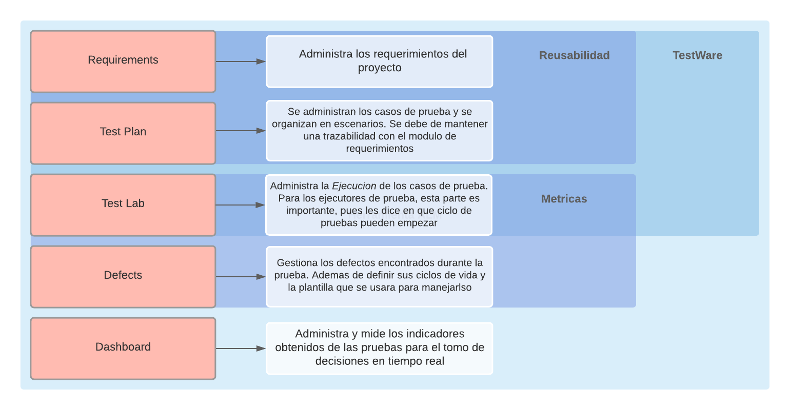

# Práctica 6 | CEPS: Capitulo 4 | 17284052

## Capitulo 4: Herramientas para la ejecucion
---
  * [Herramientas de Gestion de Pruebas](#herramientas-de-gestion-de-pruebas)
    * [Organizacion de una Herramienta de Gestion](#organizacion-de-una-herramienta-de-gestion)
  * [Herramientas para Grabar Evidencia](#herramientas-para-grabar-evidencia)
  * [Herramientas de Administracion de Defectos](#herramientas-de-administracion-de-defectos)
  * [Herramientas de Administracioan de Ambiente](#herramientas-de-administracion-de-ambiente)
  
---

### Herramientas de Gestion de Pruebas

Las herramientas de gestion de pruebas son herramientas especializadas para facilitar los procesos de prueba, y gestionar los procesos que garantizan la calidad como:

   - TestWare
   - Defectos
   - Indicadores
   - Requerimientos

#### Organizacion de una Herramienta de Gestion

Los modulos que se toman en cuenta para administrar el testware son el modulo de requerimientos, test plan, y test lab.
De los requerimientos se desprenden los casos de prueba documentados en el test plan, y del test plan se desprenden las ciclos de prueba para el test lab

### Herramientas para Grabar Evidencia

Este tipo de herramientas permite grabar las evidencias de las pruebas que se realizan. Ya sean exitosas, o fallidas.

La recomendacion de QA Testing channel fue GreenShot

### Herramientas de Administracion de Defectos

Una buena herramienta de gestion de defectos debe de poder 

Mantener y gestionar:

   * Un registro de defectos encontrados   
   * Documentacion de evidencia
   * Ciclos de vida de un defecto
   * Los roles involucrados en el defecto
    
 Entre las recomendaciones de QA Testing channel se encuentran: Bugzilla y  TC One
 
 ### Herramientas de administracion de ambiente
 
Una buena herramienta de gestion de defectos debe de poder 

Mantener:

   - Datos siempre vivos, o disponibles
   - Diagramas de bases de datos
   - Diagrama de servidores
   - Diagrama de aplicativos por servidor
   - El scheduling de los scripts de batch, de ser necesarios

Es una mini operacion de servicios de "produccion" pero para pruebas.

