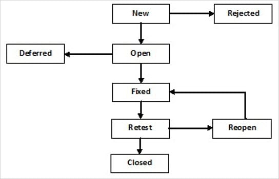
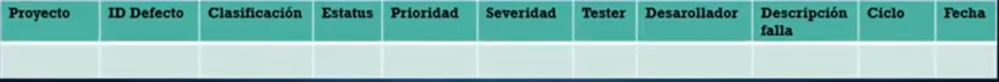

# Práctica 7 | CEPS: Capitulo 5 | 17284052

## Capitulo 5: Defectos
----
  - [Introduccion al Concepto](#introduccion-al-concepto)
  - [Defecto Accionable](#defecto-accionable)
  - [Severidad vs Prioridad](#severidad-vs-prioridad)
  - [Ciclo de Vida de un Defecto](#ciclo-de-vida-de-un-defecto)
  - [Matriz de Defecto](#matriz-de-defecto) 
    
----

### Introduccion al concepto

Un error **ES**: | Un error **NO ES**:
------------ | -------------
Una diferencia entre el resultado esperado contra el resultado actual |  Una falla por diferencias en el ambiente
Una falla funcional de codigo | Una falla por datos erroneos
.| Fallas por un malentendido en las reglas de negocio

### Defecto accionable

> Un defecto accionable es aquel defecto que tiene una **documentacion util y lo suficientemente completa** para que el area de desarrollo pueda accionar adecuadamente

Pasos para documentar un defecto accionable:
1. Asegurarse que realmente es un defecto
2. Reproducir el error
3. Tomar evidencia del error
4. documentar los pasos para la reproduccion del error
5. llenar la plantilla de documentacion del error, si es que existe
6. asegurarse que desarrollo este enterado del error

### Severidad vs Prioridad

- **Severidad:** Se enfoca en el *impacto absoluto* que el error tiene en el desarrollo  
- **Prioridad:** Se enfoca en la *importancia para el cliente* que un error pueda tener

### Ciclo de Vida de un Defecto

Pasos comunes despues de encontrar un defecto:
1. Reportar el hallazgo
2. Se notifica y envia a desarrollo
3. El responsable asignado al error lo reproduce y corrige
4. El tester revisa la correccion
5. El tester aprueba o rechaza la correccion

Dependiendo del proyecto y de sus necesidades, el ciclo de vida de un defecto y como se manejan se puede implementar de manera diferente.
Inclusive se puede manejar con ayuda de alguna herramienta

### Matriz de Defecto

Una Matriz de Defecto util debe de tener por lo menos los siguientes datos:

* Proyecto al cual pertenece
* ID del Defecto
* Clasificacion (defecto de codigo, funcional, de req., etc.)
* Estado (Cerrado, Corregido, Aceptado, etc.)
* Prioridad
* Severidad
* Tester que lo reporto
* Desarrollador asignado
* Descripcion
* Ciclo encontrado (Aceptacion, Regresion, Sistema, etc.)
* Fecha en que se encontro
