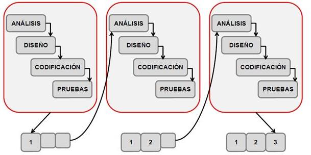
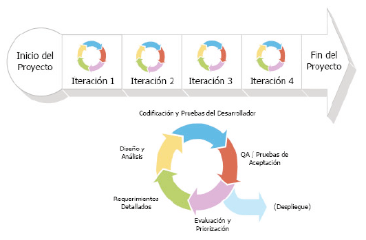

# Práctica 7 | CEPS: Capitulo 6 | 17284052

## Capitulo 6: Ejecucion Agil
----
  - [Metodos Agiles](#metodos-agiles)
    - [Ciclo de Vida Incremental](#ciclo-de-vida-incremental)
    - [Ciclo de Vida Iterativo](#ciclo-de-vida-iterativo)
    - [Ciclo de Vida Iterativo-Incremental](#ciclo-de-vida-iterativo-incremental)
  - [Ciclo de Vida Agil](#ciclo-de-vida-agil)
    
----

### Metodos Agiles

Las **Metodologias Agiles** son un tipo de proceso de gestión de proyectos

La metodología ágil es un tipo de proceso de gestión de proyectos, donde las demandas y soluciones evolucionan a través del esfuerzo de iterativo y acumulativo (sprints) de equipos pequenios auto organizados

Puntos Importantes:
* Entregables pequen~os
* Es Facil medir el progreso
* Los cambios sobre la marcha son faciles de integras

Las metodologias agiles, tienen valores e ideales en comun, que se pueden resumir con el *Manifesto Agil*, estos son algunos de los puntos

> **Individuos e interacciones** VS procesos e instrumentos  
> **El software de trabajo** VS la documentación completa  
> **La colaboración del cliente** VS la negociación del contrato  
> **Responder a un cambio** VS seguimiento de un plan  

No es que no se aprecie o haga los puntos en la derecha, pero en una metodologia agil, los de la izquierda se prefieren y tienen mucho mas peso al momento de tomar decisiones

#### Ciclo de Vida Incremental

Una de las formas que permiten a las metodologias agiles ser tan adaptable al cambio, es que *tienen ciclos de vida incremental*

*Caracteristicas:*
* Ciclos usualmente pequen~os 
* Cada uno es lo suficientemente grande para agregarle cada vez mas funcionalidad al sistema
* La integracion de las *entregables* generados se hacen en cuanto sean desarrooados 

#### Ciclo de Vida Iterativo

Una de las forma que permiten a las metodologias agiles tener entregables de alta calidad, es que *tienen ciclos de vida Iterativo*

*Caracteristicas:*
* En cada ciclo/iteracion, se **revisa y mejora el producto**
* No se an~ade mas funcionalidad entre ciclos, pero si se revisa y mejora la implementacion

#### Ciclo de Vida Iterativo-Incremental
Los ciclos de vida Iterativo e Incremental se complementan, y son fundamentales para las metodologias agiles,
Los ciclos de vida iterativo-incremental, simplemente son la combinacion de las dos ideas.

> El producto se desarrolla por incrementos en el que en **cada iteracion** se obtiene una **version funcional del producto**

*Caracteristicas:*
* Retroalimentacion continua del cliente, para mejorar el entregable
* Iteraciones cortas
* Adabtabilidad al cambio

### Ciclo de Vida Agil

El ciclo de vida agil, se puede dividir en 3 fases:

* **Planeacion:**
> 1. Los Product Owners definen los requerimientos del sistema, y lo guardan en un *Backlog*, que contiene todos los requerimientos aun no atendidos
> 2. Junto con el *Scrum Master* (La persona encargada de administrar la el proceso), los product owners generan un plan de liberacion, que detalla en cuales fechas se esperan cuales entregables
> 3. El Scrum Master plasma esos requerimientos con esos planes de liberacion en *Sprints* (cada iteracion).
     Los sprints no deben de durar mucho y deben de generar un entregable

* **Desarrollo:**
> 4. Se desarrollan los entregables durante la duracion del sprint

* **Entrega:**
> 5. Los product owners generan retroalimentacion al entregable generado por el sprint, si lo autorizan, se cumple con el requerimiento. 
   si no, se regresa al backlog
