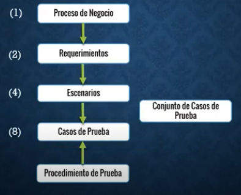

# Resumen de los capítulos 0, 1 & 2
## En el curso CEPS en la plataforma QA Testing Channel

**Perfil de un ejecutor de casos de prueba de software**
Un tester debe de contar con las siguientes habilidades / capacidades.
- Ciclo de vida de una prueba.
- Sigue un plan de ejecución y ciclos de prueba.
- Conocimientos en herramientas de gestión tipo ALM.
- Interpreta diseño de casos de prueba.
- Solicita datos para la prueba.
- Determina si el caso de prueba es exitoso, fallido, bloqueado o detenido por error.
- Interpreta indicadores y reportes de prueba.
- Entiende el plan de prueba.
- Conoce manejadores de datos y SQL simple.
- Conoce sobre pruebas funcionales, de regresión y UAT.
- Sigue proceso de prueba establecido por la companía (ágil o tradicional).
- Escribe defectos y conoce el ciclo de vida de estos.
- Documenta evidencias de prueba.

### ¿Qué es prueba de software?
Una prueba de software es la validación y verificación de los requerimientos funcionales.

### Tipos de prueba de software
- Funcional
	- Manual
	- Automatizado
- No funcional
	- Desempeño
	- Seguridad

### Ciclo de vida de pruebas
El ciclo de vida de pruebas es ciclico, es decir, que siempre se repite, y estos tienen los siguientes pasos:

1. Análisis
2. Planeación
3. Diseño
4. Ambiente
5. Ejecución
6. UAT
7. Cierre

### TestWare
Es un proceso de negocio que está constituido de requerimientos, escenarios y casos de prueba.

