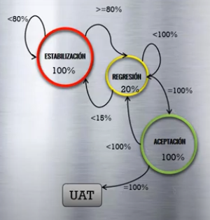

# Resumen de los capítulos 3 & 4
## En el curso CEPS en la plataforma QA Testing Channel

### Proceso de Ejecución de Prueba
**Modelo ERA / SRA:** _Estabilicación Regresión y Aceptación._

**Pre-requisitos para la ejecución:**
1. Casos de prueba.
2. Datos de prueba.
3. Ventana funcional.
4. Plan de ejecución.
5. Aplicativo bajo prueba (AUT).

**Roles y responsabilidades:**
- Ejecutor de pruebas.
- Ingeniero de pruebas.
- Líder de pruebas.
- Líder no funcional.
- Ingeniero de desempeño.
- Líder de automatización.
- Ingeniero de automatización.
- Líder de ambiente.
- Dispatcher.
- Ingeniero de datos.
- Desarrollador de software.
- Matriz de escalamiento.

### Herramientas para la Ejecución
Las herramientas de gestión de pruebas son herramientas que se utilizan para automatizar los procesos de prueba y que ayuda a gestionar todos los procedimientos para asegurar la calidad de los siguientes puntos:
- Testware
- Defectos
- Indicadores
- Requerimientos

