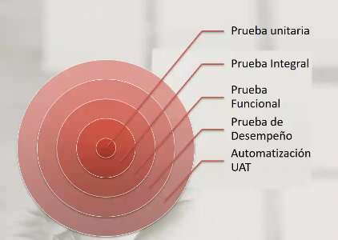

# "Las pruebas de Software, Ayer, Hoy y Mañana Parte 1" HANDS ON QA

## Epistemología
* La palabra Griega que significa "Conocimiento".
* Es el estudio de cómo sabes lo que tú sabes, el estudio de la revidencia y razonamiento.
* Tester = Epistemólogo.

## Costos de calidad
`Importancia($) = coso de detección + frecuencia + costo de corrección + costo de instalación + consto de consecuencias`
* Pérdidas de clientes y consecuencias de negocio.
* Deterioro de relaciones públicas.
* Atrasos en lo planificado.

# Costo de la calidad - Fuente de errores

# ¿Qué es una prueba de Software?
Verificar que nuestro prgrama haga lo que tene que hacer y lo que **no** tiene que hacer.

# Niveles de prueba

