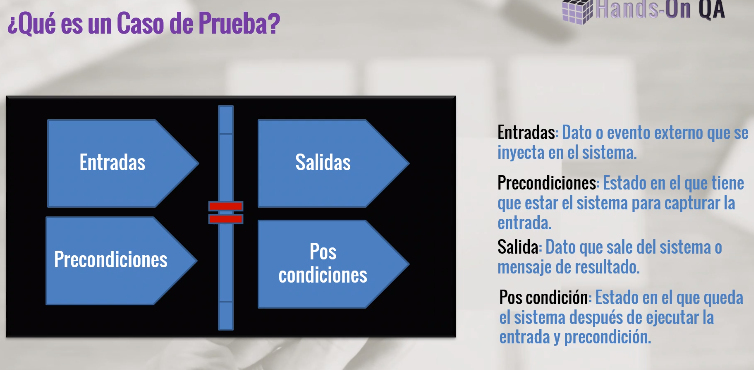
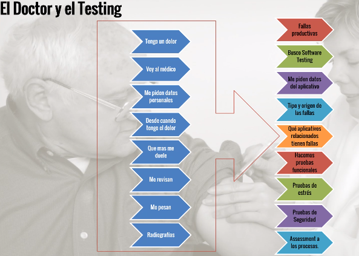
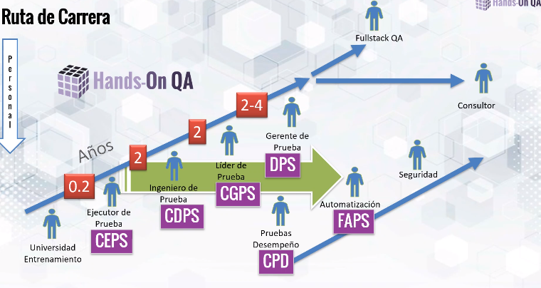

# "Las Pruebas de Software, Ayer, Hoy y Mañana Parte 2" HANDS-ON QA

## ¿Qué es un caso de prueba?

**Notas**: 
* Hay que tomar en cuenta casos negativos, no sólo casos positivos. Por ejemplo: testear que en definitiva haya un error al introducir las credenciales incorrectamente en un login.

## Mitos
Quien se dedica al testing no sabe programar.
Claro que se sabe programar. No se puede hacer testing sin entender cómo es que funciona el sistema también. Tal vez no al nivel de un desarrollador, pero sin una idea de programar, no se podría "testear" un sistema correctamente.

## Cualidades de un Tester

## El doctor y el testing
Analógicamente:

Se toma el frontend y/o backend, se analiza y los testers son los responsables de dar una revisión al software y dar "de alta" al software o decirle a los developers qué es lo que necesita el software para "sanar".

## Tipos de prueba

## Pasos a seguir si me interesan las pruebas de software
