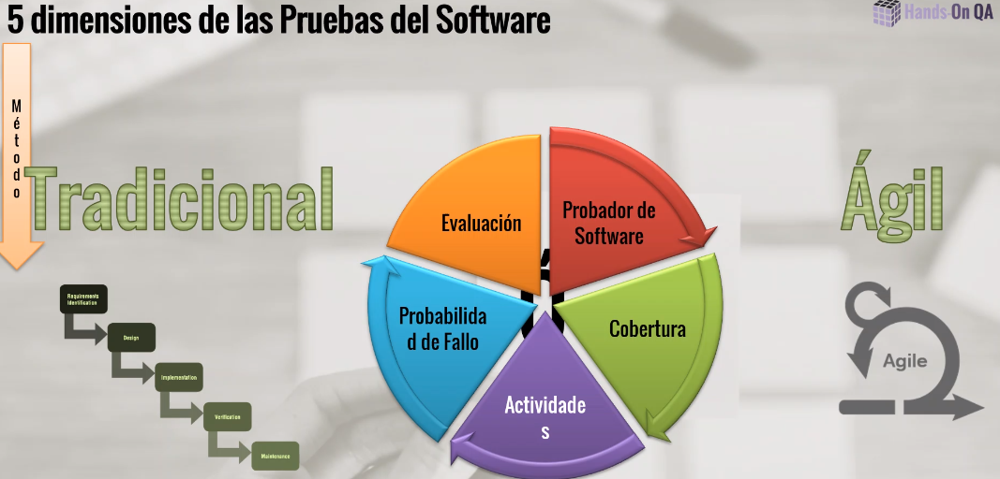

# "Las Pruebas de Software, Ayer, Hoy y Mañana. Parte 3" HANDS-ON QA

## Modelos de madurez
Te va a ayudar a mejorar tu sistema paulativamente para tener un modelo más eficiente.

## 5 dimensiones de las pruebas del Software
Se requiere calcular la probabilidad de fallo del software diagnosticándolo para ver si cumple las necesidades para ser instalado.

## Proceso de ruebas - Proyectos tradicionales

## ¿Qué es la automitazación?
Es el proceso de automatizar y sistematizar todas las actividades que se llevan de una forma manual, a través del uso de herramientass especializadas que nos ayudan a sistematizar las acciones y eventos que se verifican en una prueba de software.

## Perfiles de pruebas automatizadas
