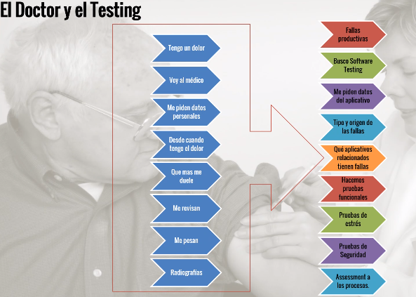

# Resumen general

## Prueba de software
Aprendí y reforcé acerca de lo que es ua prueba de software.

Recuerdo que mencionaron una frase que decía: "Verificar que nuestro prgrama haga lo que tene que hacer y lo que **NO** tiene que hacer".

Por un lado es probar que tu software te dé los resultados que deseas. Es algo que todos saben y es lo que queda siempre claro con los estudiantes a la hora de enseñar sobre esto. Pero destacaban que también hay que probar los errores.
Un ejemplo que mencionaban es un Login: ¿Qué pasa si testeas un login con una contraseña o nombre de ususario incorrecto? Se espera un error. Si no es así, el programa no está cumpliendo con las expectativas. O alguna vez también quieres testear una excepción. Hay que tomar en cuenta estos dos casos de éxito y fallo.

## Niveles de prueba
También aprendí acerca de los niveles de prueba. 

* En primer lugar está la prueba unitaria, que es son partes de código aisladas que comprueban y validan el comportamiento de un objeto y la lógica.
* Después está la prueba integral, que estos prueban que todos los elementos unitarios que componen el software, funcionan juntos correctamente probándolos en grupo.
* La prueba funcional que se lleva a cabo para comprobar las características críticas para el negocio, la funcionalidad y la usabilidad.
* Prueba de desempeño
* Automatización UAT, que estsos cubren el vacío con el que cuentan muchas compañías entre el conocimiento del usuario y el conocimiento del experto en Testing.

## Qué es un caso de prueba
También recuerdo su explicación de qué es un caso de prueba, el cual me ayudó a entenderlo de otra manera y reforzar lo ya sabido:

## La analogía de un doctor con el tester
Mencionaban analógicamente la siguiente situación:
Se toma el frontend y/o backend, se analiza y los testers son los responsables de dar una revisión al software y dar "de alta" al software o decirle a los developers qué es lo que necesita el software para "sanar".

## Tipos de prueba
También mencionaron los tipos casos de prueba:

## Modelos de madurez
Te va a ayudar a mejorar tu sistema paulativamente para tener un modelo más eficiente.

## 5 dimensiones de las pruebas del Software
Se requiere calcular la probabilidad de fallo del software diagnosticándolo para ver si cumple las necesidades para ser instalado.

## Proceso de ruebas - Proyectos tradicionales

## ¿Qué es la automitazación?
Es el proceso de automatizar y sistematizar todas las actividades que se llevan de una forma manual, a través del uso de herramientass especializadas que nos ayudan a sistematizar las acciones y eventos que se verifican en una prueba de software.

---

## Conclusión
Y esto es con lo que me quedé y lo que pude entender de una buena manera. Algunas cosas más "complejas" las consulté por mi cuenta y, por eso, puse sólo imágenes. :)